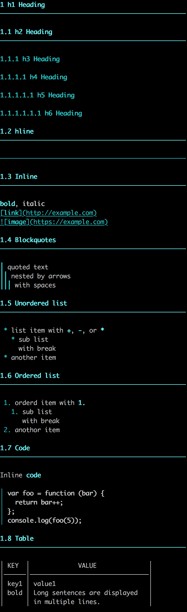

# mdterm [](https://godoc.org/github.com/tkrkt/mdterm) [](https://goreportcard.com/report/github.com/tkrkt/mdterm)

Output markdown to terminal

## Usage

```go
output := mdterm.Run(input)
fmt.Println(string(output))
```

With options:

```go
output := mdterm.Run(input,
  mdterm.WithColor("magenta"),
  mdterm.WithHeadingStyle(true, 2),
)
fmt.Println(string(output))
```

## Supported syntax

* heading
    * [x] sharp style
    * [x] underline style
* emphasis
    * [x] bold
    * [x] italic
    * [x] strikethrough
* link
    * [x] link
    * [x] image
* block
    * [x] blockquote
    * [x] source code
        * [ ] syntax highlight
* list
    * [x] unordered list
    * [x] ordered list
    * [ ] definition list
* table
    * [x] simple table
    * [ ] with align
    * [ ] with inline styling
    * [ ] without outer pipe

## Screenshot


